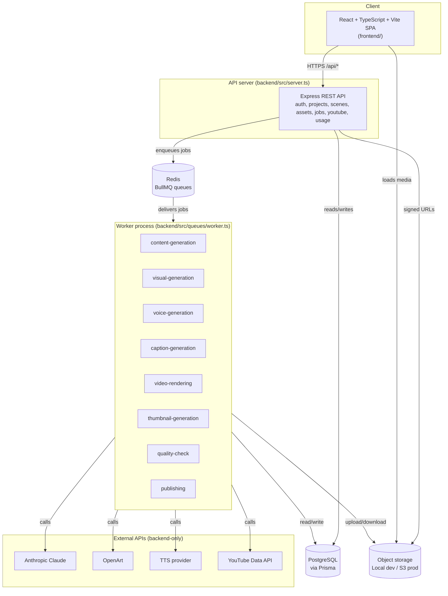

# Architecture

## System overview



## Folder structure

```
/
  .env.example              every env var, documented in ENVIRONMENT.md
  docker-compose.yml         local Postgres + Redis for development
  backend/
    prisma/schema.prisma     database schema (see DATABASE.md)
    src/
      config/env.ts          Zod-validated startup configuration
      app.ts, server.ts      Express app + HTTP entrypoint
      middleware/             auth, validation, rate limiting, error handling
      routes/, controllers/   REST API surface (see API.md)
      services/
        ai/                  AIContentProvider + ClaudeProvider + MockAIContentProvider + Zod schemas
        visual/              VisualGenerationProvider + OpenArtProvider + Mock
        voice/               VoiceGenerationProvider + TTSProvider + Mock
        storage/             StorageProvider + LocalStorageProvider + S3StorageProvider
        video/               VideoRenderer + FFmpegRenderer
        publishing/          PublishingProvider + YouTubeProvider + Mock
        project/             ProjectService + ProjectStateMachine
        job/                 JobService (durable job state in Postgres)
        asset/, caption/, usage/, auth/
        providers.ts         composition root: env vars -> concrete provider instances
      queues/
        connection.ts, queues.ts, enqueue.ts
        workers/*.worker.ts  one BullMQ Worker per pipeline stage
        worker.ts            worker-process entrypoint
      tests/                 unit + integration tests (see TESTING.md)
  frontend/
    src/
      pages/                 Dashboard, Projects, CreateProject, ProjectWorkspace, Settings, Usage, auth
      components/            Layout, ProtectedRoute, PipelineStages, JobsProgress, Toast, States, StatusBadge
      hooks/useProjects.ts    React Query hooks wrapping the REST API
      lib/api.ts, authStore.ts
      types/                 shared TypeScript types mirroring backend DTOs
```

## Provider abstractions

Every external dependency the app has is hidden behind an interface, with a real implementation and a zero-cost mock implementation, selected at runtime by an environment variable. No controller, service, or worker ever imports a vendor SDK directly.

```
controller/worker
      |
      v
providers.ts (composition root)
      |
      v
<X>Provider interface  (AIContentProvider, VisualGenerationProvider,
                         VoiceGenerationProvider, StorageProvider,
                         VideoRenderer, PublishingProvider)
      |
      +-- real implementation   (ClaudeProvider, OpenArtProvider, TTSProvider,
      |                          S3StorageProvider, FFmpegRenderer, YouTubeProvider)
      |
      +-- mock implementation   (MockAIContentProvider, MockVisualGenerationProvider,
                                  MockVoiceGenerationProvider, LocalStorageProvider,
                                  MockPublishingProvider)
```

This is what makes the whole app — including the full generation pipeline — runnable locally with zero API keys (every `*_PROVIDER` env var defaults to `mock`), and what makes swapping OpenArt for a different image API, or S3 for R2/Supabase, a one-line config change rather than a rewrite.

## Project state machine

`services/project/ProjectStateMachine.ts` is the single source of truth for which `ProjectStatus` transitions are legal (spec requirement: "do not allow impossible state transitions"). Every write to `Project.status` goes through `ProjectStateMachine.assertTransition()`. Every non-terminal state can transition to `FAILED` (a lesson from an end-to-end test that caught a job erroring out of a checkpoint state with nowhere legal to go — see the comment in that file). `PUBLISHED` and `CANCELLED` are the only terminal states; `PUBLISHING` deliberately has no path to `CANCELLED` (see below).

Most transitions go through `transitionStatus()` (read current status, assert, write). Every route that *starts* a stage from a specific expected status — generate, script regenerate, render, publish — instead goes through `transitionStatusIfCurrent(projectId, expectedFrom[], to)`, a single conditional `UPDATE ... WHERE status IN (...)`. The difference matters under concurrency: two requests racing through a plain read-then-write can both read the same pre-transition status and both proceed (e.g. both upload the same video to YouTube). Postgres serializes concurrent updates to one row, so of two racing CAS calls only one can match the `WHERE` clause; the loser's `updateMany` affects zero rows and the caller treats that as "someone else already claimed this" instead of duplicating the side effect. `publishToYoutube()` is the sharpest example: it claims `READY_FOR_REVIEW -> PUBLISHING` before creating a `PublishingJob`, and reverts to `READY_FOR_REVIEW` if anything fails before the upload is even enqueued (see `youtube.controller.ts` and `ProjectStateMachine.test.ts`'s `PUBLISHING` suite).

## Background job pipeline

`POST /api/projects/:id/generate` enqueues a `CONTENT_GENERATION` job and returns immediately (HTTP 202) — the browser never blocks on AI/media generation. Each worker, on success, enqueues the next stage(s), so the whole pipeline runs as a chain of small, independently retryable jobs rather than one long-running request:

```
content-generation (script + scenes + character bible)
        |
        v
visual-generation (one job per scene, parallel)
        |  (all scenes' images done)
        v
voice-generation (one job per scene, parallel)
        |  (all scenes' narration done)
        v
caption-generation (one job, builds SRT from narration timing)
        |
        +--> video-rendering (FFmpeg: combine images + narration + captions)
        |            |
        |            v
        |      quality-check (Claude reviews the script for issues)
        |            |
        |            v
        |      READY_FOR_REVIEW
        |
        +--> thumbnail-generation (runs in parallel with rendering)

publishing (only ever enqueued from an explicit, user-confirmed
            POST /projects/:id/youtube/publish call -- never automatic;
            attempts:1, no automatic BullMQ retry, since a retry after
            a successful-but-then-failed upload would re-upload the
            same video)
```

Every stage persists its output (Script/Scene/Character rows, Asset rows, the rendered Video row) before the next stage is enqueued. This is what makes the pipeline resumable: if `video-rendering` fails, the script, scene images, and narration already exist, so only that one job needs to retry — the whole project does not restart from scratch. Each `Job` row (Postgres) tracks type/status/progress/retryCount/error independently of the underlying BullMQ job, which is what the frontend polls (`GET /projects/:id` returns the job list; the workspace UI self-polls every 2s while any stage is in progress).

**Fan-in races.** Every scene's `visual-generation` (and `voice-generation`) job runs concurrently (worker `concurrency: 3`), and the *last* one to finish is responsible for deciding "are all sibling jobs for this pipeline run done? if so, enqueue the next stage." With true parallelism, two or three sibling jobs can finish within milliseconds of each other and *all* observe "yes, all done" — without a guard, that means the next stage's whole job batch gets enqueued once per straggler instead of once per pipeline run. Every cascaded `enqueueJob()` call carries a deterministic `idempotencyKey` (e.g. `voice-generation:${pipelineRunId}:${sceneId}`), and `JobService.create()` treats a unique-constraint collision on that key as "return the row that already won" rather than an error — so redundant firings collapse to exactly one job each, no matter how many sibling completions raced to trigger them. See `visualGeneration.worker.ts`, `voiceGeneration.worker.ts`, and `concurrency.test.ts`.

## Security posture

- Every project-scoped resource (scenes, assets, jobs) is loaded through an ownership check that returns 404 for a nonexistent id and 403 for someone else's id — never leaking which is which by status code alone in a way that would help enumerate ids (see `resourceOwnership.test.ts`).
- Passwords: bcrypt, one-way. Sessions: stateless JWT signed with `JWT_SECRET`. Email is normalized to lowercase before every lookup/insert so `Foo@Example.com` and `foo@example.com` are the same account.
- The YouTube OAuth `state` parameter is a short-lived JWT binding the flow to the user who started it (`services/auth/oauthState.ts`), not the raw user id. The callback route is unauthenticated by necessity (Google's redirect carries no Authorization header), so without this an attacker could craft a callback URL that links *their own* YouTube account to a victim's app account — a state parameter that's just an id, with nothing verifying who initiated the flow, is a classic OAuth CSRF / account-linking hole (RFC 6749 §10.12).
- YouTube OAuth tokens: encrypted at rest (AES-256-GCM, key derived from `SESSION_SECRET`), never logged (Pino redaction list in `utils/logger.ts`).
- Anthropic/OpenArt/TTS/YouTube API keys live only in backend environment variables — never sent to, or readable by, the frontend.
- Every request body is validated with Zod before it reaches a controller.
- Rate limiting (global + stricter on auth endpoints) is real `express-rate-limit` middleware, automatically disabled only under `NODE_ENV=test` so the test suite isn't throttled.
- 5xx error responses never include `details` — only the message. `details` on other AppErrors (validation, ownership, state conflicts) is safe by construction (it's our own structured data), but a `ProviderError`'s `details` can carry a raw upstream response body from OpenArt/YouTube/etc.; that goes to the server log, never to the client.
- `LocalStorageProvider`'s path-containment check requires the storage root to be followed by a path separator (or matched exactly), not just a string prefix — a bare `startsWith(root)` would wrongly treat a sibling directory like `storage-evil/` as "inside" `storage/` since it shares the same string prefix.
